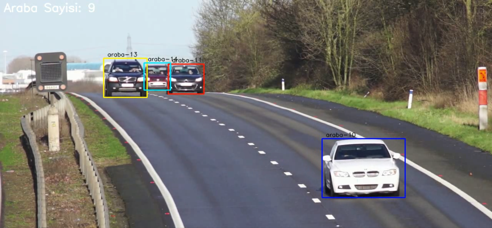

<div align="center">

# 🚗 Vehicle Tracking & Counting — YOLOv11 + DeepSORT


** English** · [ Türkçe](#tr)



</div>

##  Overview

Detects vehicles in a video with a **custom-trained YOLOv11 model**, assigns each one a persistent ID with **DeepSORT**, and counts the number of unique vehicles that pass through the scene.

### What I built
- 🎯 **Trained a single-class YOLOv11 detector** (`best.pt`) on a car dataset (the original project tracked people with YOLOv8)
- 🔗 Connected YOLOv11 detections to the **DeepSORT** tracker (Kalman filter + appearance re-identification)
- 🔢 **Unique-ID counting**: every confirmed track ID is counted once → total vehicles in the video
- 🎨 Per-ID colored bounding boxes, live FPS measurement and annotated video export (`output.mp4`)
- ⚡ Runs on GPU (CUDA) automatically, falls back to CPU

### Pipeline
```
video frame ─► YOLOv11 (best.pt, conf ≥ 0.8) ─► boxes + scores
            ─► DeepSORT (Kalman + ReID CNN)  ─► stable track IDs
            ─► draw boxes · count unique IDs  ─► output.mp4
```

### Run
```bash
pip install -r requirements.txt
python Main.py          # reads araba.mp4, writes output.mp4 — press q to quit
```

| File | Purpose |
|---|---|
| `Main.py` | Detection + tracking + counting loop |
| `best.pt` | Custom-trained YOLOv11 weights (car class) |
| `deep_sort/` | DeepSORT implementation + ReID checkpoint |
| `araba.mp4` | Sample input video |

### Credits
Based on [AarohiSingla/Tracking-and-counting-Using-YOLOv8-and-DeepSORT](https://github.com/AarohiSingla/Tracking-and-counting-Using-YOLOv8-and-DeepSORT); DeepSORT implementation from [ZQPei/deep_sort_pytorch](https://github.com/ZQPei/deep_sort_pytorch). I upgraded it to YOLOv11 and retrained it for vehicles.

---

<a name="tr"></a>

##  Türkçe

Videodaki araçları **özel eğitilmiş bir YOLOv11 modeli** ile tespit eder, **DeepSORT** ile her araca kalıcı bir kimlik (ID) atar ve sahneden geçen benzersiz araç sayısını hesaplar.

### Neler yaptım
- 🎯 Araç veri seti üzerinde **tek sınıflı bir YOLOv11 modeli eğittim** (`best.pt`). Orijinal proje YOLOv8 ile insan takibi yapıyordu.
- 🔗 YOLOv11 tespitlerini **DeepSORT** takipçisine bağladım (Kalman filtresi + görünüm tabanlı yeniden tanıma)
- 🔢 **Benzersiz ID sayımı**: onaylanmış her takip ID'si bir kez sayılır ve videodaki toplam araç sayısı elde edilir
- 🎨 Her ID için ayrı renkte kutu, anlık FPS ölçümü ve işlenmiş videonun kaydı (`output.mp4`)
- ⚡ CUDA varsa GPU'da, yoksa CPU'da çalışır

### Çalıştırma
```bash
pip install -r requirements.txt
python Main.py          # araba.mp4 dosyasını okur, output.mp4 üretir — çıkmak için q
```

### Kaynaklar
[AarohiSingla/Tracking-and-counting-Using-YOLOv8-and-DeepSORT](https://github.com/AarohiSingla/Tracking-and-counting-Using-YOLOv8-and-DeepSORT) projesi temel alınmıştır. DeepSORT uygulaması [ZQPei/deep_sort_pytorch](https://github.com/ZQPei/deep_sort_pytorch) reposundan gelir. Projeyi YOLOv11'e yükselttim ve araç tespiti için yeniden eğittim.
